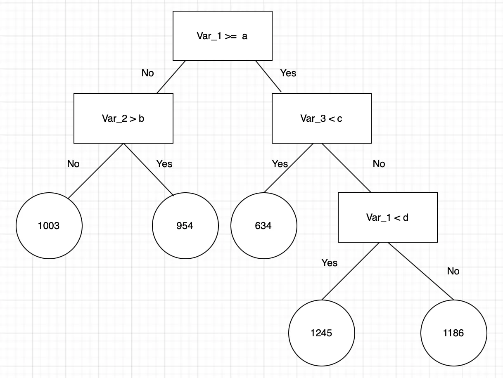

# Random Forest Regression for Continuous Data Prediction

Random Forest Regression is an ensemble learning model widely used for both high-dimensional data classification and continuous value prediction. This algorithm constructs multiple decision trees during the training phase and combines their outputs by averaging predictions to enhance accuracy and reduce overfitting. In our case, it is applied to predict the number of bike rentals for each day, leveraging its ability to handle complex relationships in the data.

Random Forest works by building multiple decision trees, each created from a subset of the data and based on the relationship between the target variable and the independent features. At each node, it recursively selects the best split based on the features, improving the model’s ability to make accurate predictions. Once all trees are built, their predictions are aggregated—either by averaging (for regression) or voting (for classification)—to give the final result. This ensemble approach reduces overfitting and enhances prediction accuracy, making it especially effective for complex datasets.

