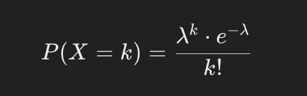
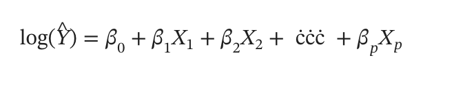

# Poisson's Regression for Continuours Data Prediction

Poisson regression is a powerful statistical tool used to model count data, named after the mathematician Siméon Denis Poisson, whose work significantly advanced probability theory. This technique is especially useful in fields such as epidemiology, economics, and social sciences, where the goal is to predict the frequency or count of events. By understanding and applying Poisson regression, analysts can gain valuable insights into patterns and occurrences within count-based data. This method has become an essential approach for studying situations where the response variable is a count of events.

In Poisson Regression, the model estimates 
𝜆
λ based on predictors, allowing for predictions that vary with the input data. This method is especially effective for modeling situations where the response variable is a count, making it invaluable in a wide range of applications.

The Poisson distribution formula is:

Poisson regression models the log of the expected count as a linear combination of the predictor variables. For example, if Y is the count we want to predict and X1, X2, X3,.....,Xn are predictor variables then:

### Issues with Poisson's Regression

- Equidispersion Assumption: Assumes equal mean and variance, which doesn’t always hold in real-world data, leading to biased predictions when overdispersion (variance > mean) occurs.
- Zero-Inflation: Struggles with datasets that have excess zeros (zero-inflated data), requiring alternatives like Zero-Inflated Poisson Regression.
- Linear Log Relationship: Assumes a linear relationship between predictors and the log of the expected count, which may not capture complex, nonlinear patterns.
-   Sensitivity to Outliers: Outliers in the data can disproportionately affect predictions.
